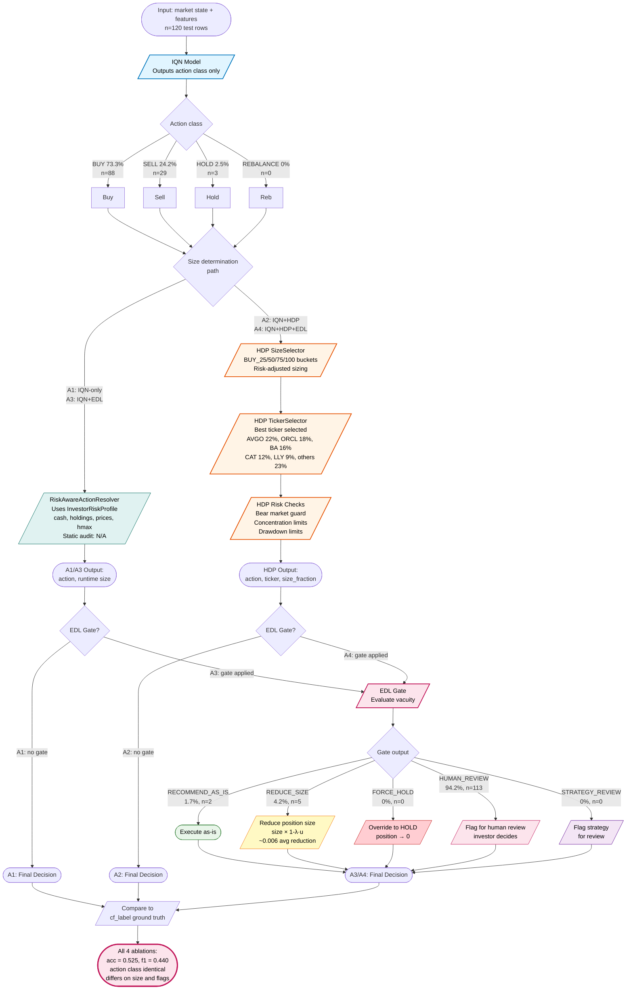
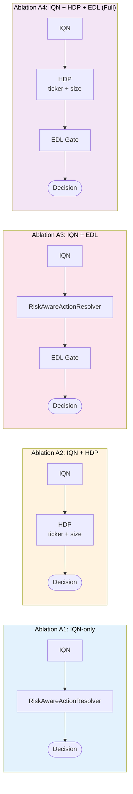
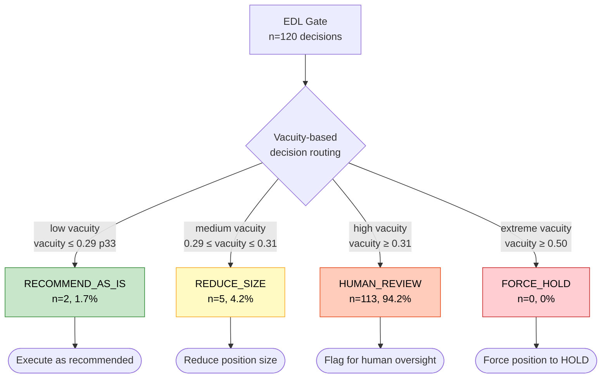
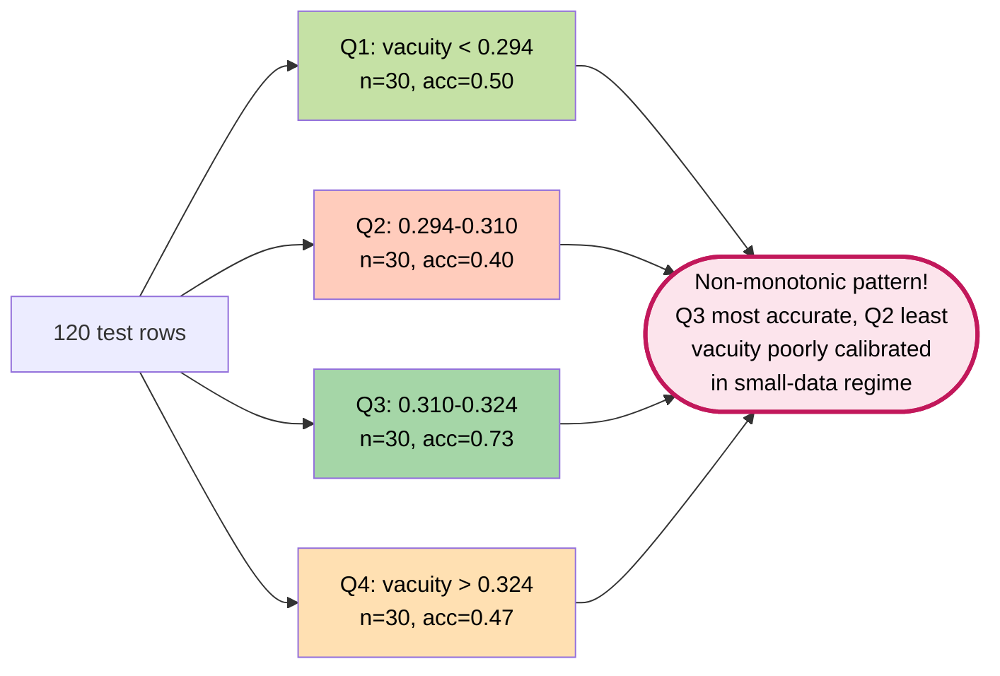

# D-IQN-DSS Pipeline Flow Diagram

## Full Pipeline Architecture

---

## Per-Ablation Decision Flow (Simplified)

---

## Gate Output Distribution

---

## Confidence Calibration Pattern (Phase B.5 Finding)

---

*Generated: Phase B.5 enriched ablation suite documentation*
*Reference: outputs/runs/2026_05_27_165904_d_iqn_dss_phase_b5_ablation_suite/*
